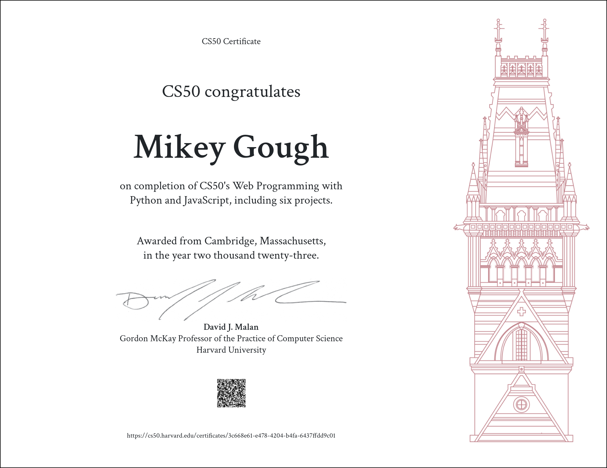

# cs50w
Harvard's CS50W: Web Programming with Python and JavaScript

#### [CS50W](https://bit.ly/3IRsNDw)
this course picks up where CS50x leaves off, diving more deeply into the design and implementation of web apps with Python, JavaScript, and SQL using frameworks like Django, React, and Bootstrap. topics include database design, scalability, security, and user experience. through hands-on projects, students learn to write and use APIs, create interactive UIs, and leverage cloud services like GitHub and Heroku. by semester’s end, students emerge with knowledge and experience in principles, languages, and tools that empower them to design and deploy applications on the Internet. the [final project](https://github.com/mikeygough/discogskiii-django) combines all learnings.

<ul>
  <li>HTML, CSS</li>
  <li>Git</li>
  <li>Python</li>
  <li>Django</li>
  <li>SQL, Models, and Migrations</li>
  <li>JavaScript</li>
  <li>User Interfaces</li>
  <li>Testing, CI/CD</li>
  <li>Scalability and Security</li>
</ul>

